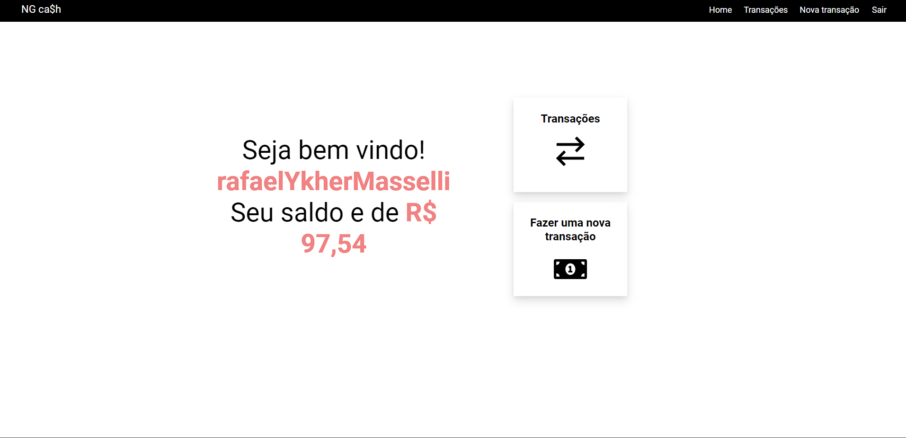

<h1 align="center"> ⭐ Front-end dockerizada ⭐</h1>

## 🗒️ Requisitos para iniciar o projeto

### - [IDE](https://code.visualstudio.com/)

### - [Git](https://git-scm.com/)

### - [Node JS](https://nodejs.org/en/)

<hr>

## ☕ Iniciando o projeto

```bash
## Com o back-end rodando.
## Entre na pasta do front-end
$ cd client

## Instale as dependências
$ yarn && npm i

## Depois de instalar as dependências inicie o projeto
$ yarn dev

## E assim ira abrir o projeto
```



<hr>

## ⭐ Dependências usadas no projeto

### - React TypeScript

### - Sass

### - React icons

### - React-modal

### - Axios
